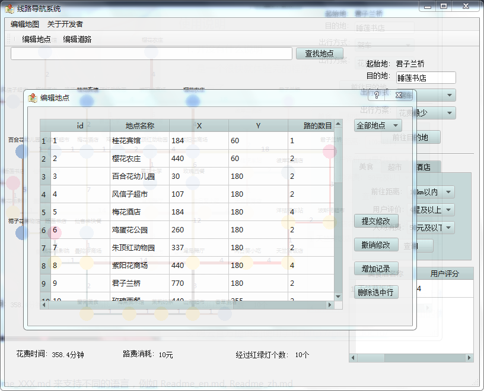

# Qt线路导航系统

#### 项目介绍
是数据结构课的作业

#### 软件架构
基于Qt5.6.1开发的线路导航系统,第一次使用了MVP模式(虽然)

#### 安装教程

1. 并没有教程
2. 如果是windows的话,解压zip包应该就可以运行了
3. 其他的平台是不行的

#### 使用说明

1. 并没有什么说明
2. 是一个很快就体验完的程序
3. 没有了

#### 参与贡献

1. 只有我自己呀

#### 图片预览

github地址:https://github.com/100Ohm/Data-structure-Graph-Qt-Navigation-System

gitee地址:https://gitee.com/one_hundred_ohms/qt_line_navigation_system